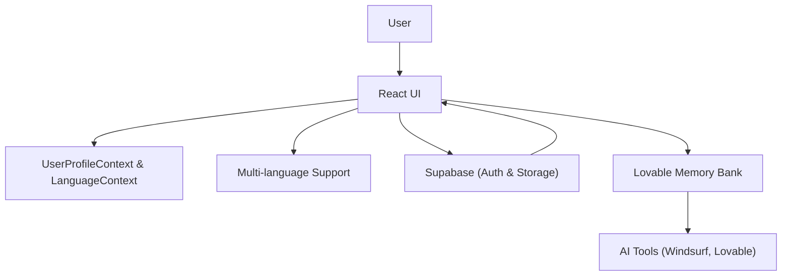

# Blood Test & Ortho-Molecular Health Project

A modern, privacy-focused web application for analyzing blood test results, tracking personal health data, and providing ortho-molecular insights. Designed for accessibility, internationalization, and extensibility.

---

**Live:**  
- https://mabu.red  
- [Lovable Project](https://lovable.dev/projects/38dac377-5105-483b-bf8a-d4995e212fd7)

**License:**  
[Apache 2.0 License](./LICENSE)

---

## 🚀 Purpose

Empower users to interpret blood test results, track health trends, and receive tailored recommendations—all while keeping their data secure and under their control. The app supports international users, advanced accessibility, and seamless integration with health data providers.

---

## 🤝 Contributing

Contributions are welcome! Please:
- Fork the repo and create a feature branch
- Follow the code style in `.eslintrc.json` and `.prettierrc`
- Document major decisions in `lovable-memory-bank/decisionLog.md`
- Submit a pull request with a clear description

---

## 🧠 Memory Bank System

All persistent decisions, design rationales, and product context are stored in the `lovable-memory-bank` directory:
- `decisionLog.md`: Architectural, UI, and business decisions
- `productContext.md`: Product vision and goals
- `progress.md`: Milestones and progress tracking
- `systemPatterns.md`: Reusable system and code patterns
- `activeContext.md`: Current context for ongoing development

This system keeps the project transparent, auditable, and easy to onboard for new contributors.

---

## 🛠️ Tools & Technologies

- **Vite**: Lightning-fast build and dev server
- **TypeScript**: Type-safe codebase
- **React**: Component-based UI
- **shadcn-ui**: Accessible UI primitives
- **Tailwind CSS**: Utility-first styling
- **Supabase**: Backend-as-a-Service for auth & storage
- **Lovable**: AI-powered code collaboration
- **Windsurf**: AI pair programming

---

## 📁 Folder Structure

```text
blood-test/
├── LICENSE
├── README.md
├── package.json
├── public/
│   └── ReferenceValues.md
├── src/
│   ├── App.tsx
│   ├── components/
│   ├── context/
│   ├── hooks/
│   ├── integrations/
│   ├── lib/
│   ├── locales/
│   ├── pages/
│   └── main.tsx
├── lovable-memory-bank/
│   ├── decisionLog.md
│   ├── productContext.md
│   ├── progress.md
│   ├── systemPatterns.md
│   └── activeContext.md
├── supabase/
│   └── ...
└── ...
```

### 📂 Most Important Files & Folders

| File/Folder                | Purpose & Description                                                        |
|---------------------------|------------------------------------------------------------------------------|
| `README.md`               | Main documentation for project purpose, setup, and architecture               |
| `LICENSE`                 | Apache 2.0 license with third-party notices (Supabase, Lovable)               |
| `package.json`            | Project dependencies, scripts, and metadata                                   |
| `public/`                 | Static assets (e.g., `ReferenceValues.md` for blood marker ranges)            |
| `src/`                    | Main source code (see below for subfolders)                                   |
| `src/App.tsx`             | Root React component                                                          |
| `src/components/`         | UI components (forms, charts, dialogs, etc.)                                  |
| `src/context/`            | App-wide React context providers (e.g., `UserProfileContext.tsx`)             |
| `src/hooks/`              | Custom React hooks                                                            |
| `src/integrations/`       | External service integrations (e.g., Supabase)                                |
| `src/lib/`                | Utility functions and shared logic                                            |
| `src/locales/`            | Language translation files (e.g., `en.ts`)                                   |
| `src/pages/`              | Page-level React components                                                   |
| `src/main.tsx`            | React app entry point                                                         |
| `lovable-memory-bank/`    | Persistent memory system (see below for files)                                |
| `lovable-memory-bank/decisionLog.md` | Major technical and product decisions                                 |
| `lovable-memory-bank/productContext.md` | Product vision and goals                                         |
| `lovable-memory-bank/progress.md`     | Progress tracking and milestones                                   |
| `lovable-memory-bank/systemPatterns.md` | Reusable patterns                                               |
| `lovable-memory-bank/activeContext.md` | Development context                                              |
| `supabase/`               | Supabase integration configuration                                            |

If you want a more detailed description of any specific file or folder, just ask!

---

## 🏗️ Architecture



---

## 📝 Editing & Deployment

- **Via Lovable:** [Open project](https://lovable.dev/projects/38dac377-5105-483b-bf8a-d4995e212fd7) and prompt changes.
- **Locally:** Clone, install (`npm i`), and run (`npm run dev`).
- **GitHub:** Edit files and commit via the web UI or Codespaces.
- **Deploy:** Use Lovable's Share → Publish. See [custom domain setup](https://docs.lovable.dev/tips-tricks/custom-domain#step-by-step-guide).

---

For questions or contributions, open an issue or PR. See the LICENSE for legal details and third-party notices.

- later:
- N8N for AI Agents

## How can I deploy this project?

Simply open [Lovable](https://lovable.dev/projects/38dac377-5105-483b-bf8a-d4995e212fd7) and click on Share -> Publish.

